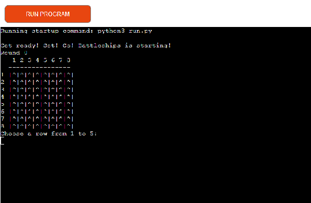
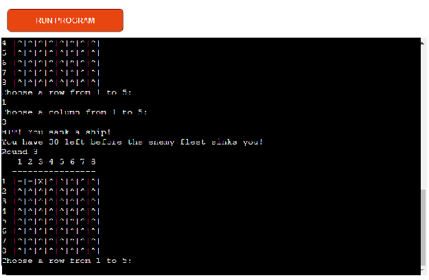
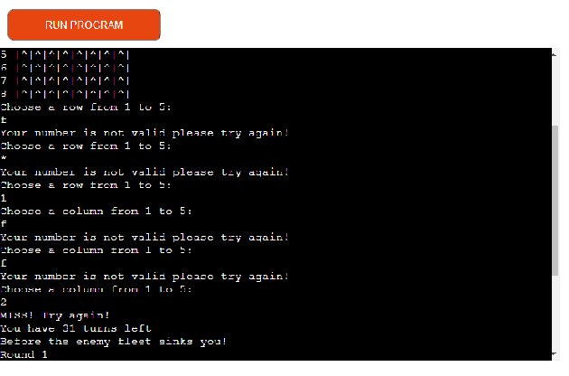
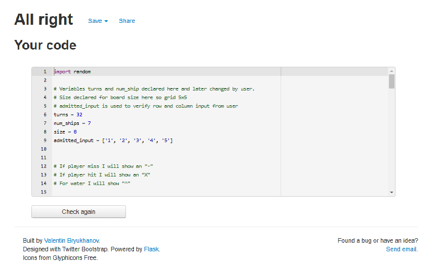

# Shooting Ships

# Link To Game

<a href="https://shooting-ships.herokuapp.com/" target="_blank" rel="noopener">Link To Game</a>

# Content

1. Presentation
2. How to play
3. Features
4. Testing
5. Bugs
6. Tools
7. Deployment
8. Credits

# Presentation
* This is a battleships game made to run in Heroku terminal. Further down you will find a how to play explaning the game.
* 

# Features
* You will have to hit all ships before your turns reach 0.
* There will be 7 ships on a 8x8 grid (64 spaces.), and you will have 32 turns to hit all ship.

# Features
* Features currently in-game:
    * Counter for ships hit if you hit all ships on enemy board you win.
    * Counter for turns, so if you havent sunk all ships within a set range of turns you lose.
    * Ships are randomly placed by computer to board.
    * Accepts user inputs for where to shoot.
        * If not in a valid scope it will print something in the lines of "try again".
        * 

* Future Features
    * In the future I want to add class code to the game.
    * Add choice for how big the board, num_ships, turns and if you want to play against PC or Player.
    * Add more visual satisfying UI to the game.

# Testing
* I have tested this game in the CodeInstitutes heroku terminal and in Gitpod terminal.
    * For instance i have tried inputting invalid data to make sure my functions do not break down.
    ## Validation
    * Tested on an online pep8 tester.
    * 

# Bugs
* During the work on this project I had alot of bugs.
    * If user put in a symbol/letter instead of number when choosing where to shoot, it made the game crash.
        * To solve this I added all approved numbers in a list and checked if their input was in this.
        * I also had to add a check for empty strings to make sure nothing can go wrong.
    * Counter did not work properly at first.
        * This was because of a return statement being indented too far.
    * Gitpod is complaining over unused variable on line 35,9 "ships" unused, however this does not create any problems.

# Tools
* GitHub and GitPod was used to write and save the code.
* Deploying the project was done on Heroku.
* StackOverflow for finding different solutions to error messages in my code.

# Deployment
This project was deployed using CodeInsitutes Mock Terminal for Heroku.
* Steps for deploying was as follow:
    * Login to Heroku.
    * Click new and then create new app.
    * Go into settings and add Config VAR: Key = "PORT" Value = "8000".
    * In settings also add Python and Nodejs buildpacks. (Order is important Python should be on top of list.)
    * Click deploy.
    * Click deploy using Github and connect Github to Heroku.
    * Choose your repository and branch.
    * Enable automatic deploy.
    * Click deploy and wait for Heroku to finish.

# Credits
* This project was deployed using CodeInsitutes mock terminal on Heroku
* StackOverFlow was used to find different solutions to code errors.
* PythonTutor was used to read more about python language.